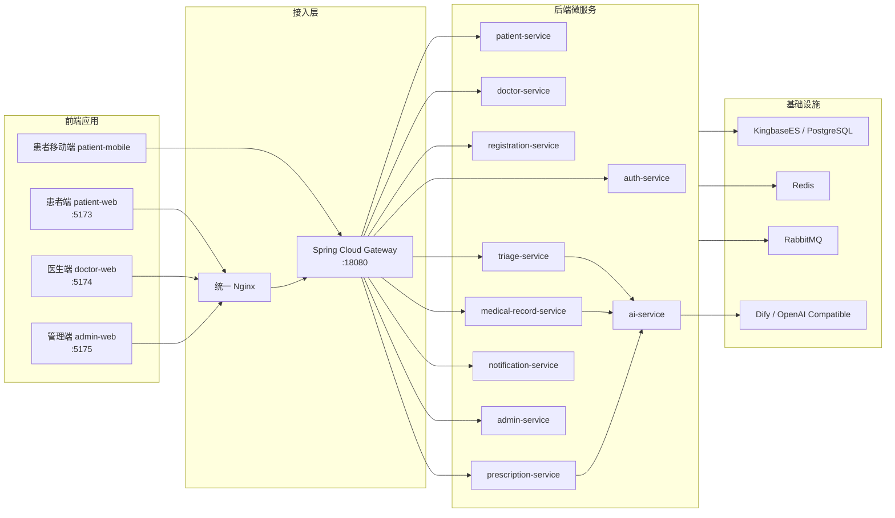

# 智慧云脑诊疗平台

<p align="center">
  <strong>面向患者、医生、管理员的 AI 辅助诊疗微服务平台</strong>
</p>

<p align="center">
  <a href="#技术栈"></a>
  <a href="#技术栈"></a>
  <a href="#技术栈"></a>
  <a href="#快速开始"></a>
  <a href="#项目结构"></a>
</p>

智慧云脑诊疗平台是一个前后端分离的智慧医疗演示系统，覆盖患者就诊、AI 分诊、医生接诊、AI 病历生成、处方审核、消息通知、排班管理、系统字典和内容配置等核心流程。

项目采用 Spring Boot 3 微服务后端、Vue 3 多端前端、KingbaseES/PostgreSQL 兼容数据库、RabbitMQ、Redis、Docker Compose 与可切换 AI Provider，适合作为医疗业务中台、AI 应用接入、微服务拆分和多端前端工程化的综合样板。

## 目录

- [功能亮点](#功能亮点)
- [系统架构](#系统架构)
- [技术栈](#技术栈)
- [项目结构](#项目结构)
- [快速开始](#快速开始)
- [访问入口](#访问入口)
- [默认账号](#默认账号)
- [本地开发](#本地开发)
- [AI 配置](#ai-配置)
- [数据库与种子数据](#数据库与种子数据)
- [常用命令](#常用命令)
- [开发约定](#开发约定)

## 功能亮点

| 角色 | 能力 |
| --- | --- |
| 患者端 | 注册登录、AI 分诊、科室与医生查询、号源预约、就诊人管理、病历与处方查看、通知消息 |
| 医生端 | 今日队列、患者接诊、AI 病历草稿、处方开立与审核、风险提示、实时通知 |
| 管理端 | 数据看板、医生与科室管理、排班发布、Prompt 模板、知识库、药品库、系统字典、患者站点配置 |
| AI 能力 | 分诊建议、病历生成、处方风险检查，支持 Dify、OpenAI 兼容接口和本地 Mock |
| 工程能力 | 微服务拆分、统一网关、JWT 鉴权、WebSocket 通知、对象存储配置、pnpm workspace 共享包 |

## 系统架构



## 技术栈

| 层级 | 技术 |
| --- | --- |
| 前端 | Vue 3、TypeScript、Vite、Pinia、Vue Router、Tailwind CSS、ECharts、pnpm workspace |
| 后端 | JDK 17、Spring Boot 3.3、Spring Cloud Gateway、OpenFeign、Spring Data JPA、Validation、Actuator |
| 通信 | REST API、WebSocket、RabbitMQ、JWT |
| 数据 | KingbaseES / PostgreSQL 兼容模式、Redis |
| AI | Dify Workflow、OpenAI Compatible Provider、DeepSeek、Mock Provider |
| 工程 | Docker Compose、Maven multi-module、Nginx、JaCoCo、Postman |

## 项目结构

```text
smart_cloud_brain/
├── backend/                  # Spring Boot 多模块微服务
│   ├── gateway-service/       # API 网关与鉴权路由
│   ├── auth-service/          # 登录认证、JWT 签发
│   ├── patient-service/       # 患者、就诊人、患者站点数据
│   ├── doctor-service/        # 医生、队列、接诊能力
│   ├── registration-service/  # 排班、号源、挂号预约
│   ├── triage-service/        # AI 分诊记录
│   ├── medical-record-service/# 病历生成与保存
│   ├── prescription-service/  # 处方与审方
│   ├── notification-service/  # 通知、邮件、WebSocket
│   ├── admin-service/         # 管理端聚合能力
│   ├── ai-service/            # AI Provider 适配层
│   ├── ai-api/                # AI DTO 与共享接口
│   └── common-lib/            # 通用响应、鉴权、工具类
├── frontend/                 # Vue pnpm monorepo
│   ├── apps/
│   │   ├── patient-web/       # 患者端 Web，开发端口 5173
│   │   ├── doctor-web/        # 医生端 Web，开发端口 5174
│   │   ├── admin-web/         # 管理端 Web，开发端口 5175
│   │   └── patient-mobile/    # 患者移动端入口
│   └── packages/
│       ├── shared-api/        # API 封装
│       ├── shared-ui/         # 共享组件库
│       ├── shared-types/      # 共享类型
│       └── shared-utils/      # 共享工具
├── deploy/                   # Docker Compose、Nginx、环境变量
├── sql/                      # 建表脚本与演示种子数据
├── scripts/                  # 启停、构建、验证脚本
└── postman/                  # 接口调试集合
```

## 快速开始

### 环境要求

- JDK 17
- Node.js 24 或兼容版本
- Corepack + pnpm 9.15
- Docker Desktop / Docker Compose
- KingbaseES 镜像，或可兼容 PostgreSQL 的本地替代环境

### 一键启动

Windows 推荐使用项目脚本：

```powershell
.\scripts\start-local.ps1
```

也可以直接使用 Docker Compose：

```powershell
docker compose --env-file deploy\env\.env -f deploy\docker-compose.yml up -d --build
```

首次启动会构建后端服务镜像、初始化数据库、启动 RabbitMQ、Redis、Gateway、各业务服务和统一 Nginx 前端容器。

> 如果本机没有 KingbaseES 镜像，请先从项目维护者处获取对应架构的镜像 tar 包，并执行 `docker load -i <your-kingbase-image>.tar`。ARM 设备可在 `deploy/.env` 中设置 `KINGBASE_IMAGE=kingbase_v009r001c010b0004_single_arm:v1`。

## 访问入口

| 服务 | 地址 |
| --- | --- |
| 患者端 | http://localhost:5173 |
| 医生端 | http://localhost:5174 |
| 管理端 | http://localhost:5175 |
| Gateway | http://localhost:18080 |
| Nginx 总入口 | http://localhost:18000 |
| RabbitMQ 管理台 | http://localhost:15672 |
| AI Service | http://localhost:8081 |

## 默认账号

所有种子账号默认密码均为 `123456`。

| 角色 | 账号 | 密码 |
| --- | --- | --- |
| 患者 | `13800000001` | `123456` |
| 医生 | `13900000001` | `123456` |
| 管理员 | `admin` | `123456` |

## 本地开发

开发前端时推荐使用 Vite dev server，后端 API 继续走 Docker 中的 Gateway。

先释放 5173、5174、5175 端口：

```powershell
docker stop scb-nginx
```

分别启动三端：

```powershell
cd frontend\apps\patient-web
$env:VITE_GATEWAY_MODE="docker"; npx vite --port 5173
```

```powershell
cd frontend\apps\doctor-web
$env:VITE_GATEWAY_MODE="docker"; npx vite --port 5174
```

```powershell
cd frontend\apps\admin-web
$env:VITE_GATEWAY_MODE="docker"; npx vite --port 5175
```

前端源码修改后由 Vite HMR 自动刷新。验收结束后可恢复 Nginx：

```powershell
docker start scb-nginx
```

## AI 配置

`ai-service` 默认面向 Dify Workflow。真实模型 Key 建议配置在 Dify 控制台中，本项目只保存 Workflow API Key。

```env
AI_PROVIDER=dify
DIFY_BASE_URL=http://your-dify/v1
DIFY_TRIAGE_API_KEY=app-...
DIFY_MEDICAL_RECORD_API_KEY=app-...
DIFY_PRESCRIPTION_CHECK_API_KEY=app-...
```

也可以直接接入 OpenAI 兼容服务：

```env
AI_PROVIDER=openai
OPENAI_API_KEY=sk-...
OPENAI_BASE_URL=https://api.deepseek.com
OPENAI_MODEL=deepseek-v4-flash
```

本地演示可显式启用 Mock：

```env
AI_PROVIDER=mock
```

AI 调用会写入 `ai_generation_log`，只记录摘要和状态，不保存完整隐私医疗文本。分诊、病历生成、处方审核读取 `prompt_template` 中启用的模板，管理端修改模板后会影响后续 AI 输出。

## 数据库与种子数据

主初始化脚本位于 `sql/kingbase_schema.sql`，包含：

- 患者、医生、管理员、科室、药品、知识库
- 系统字典、角色权限、患者站点配置
- Prompt 模板、AI 生成日志
- 医生排班、可预约号源
- 病历、处方、通知、审计日志等业务表

挂号、病历、处方、通知等交易数据可以通过完整演示流程生成。

## 常用命令

### 前端

```powershell
cd frontend
corepack pnpm install
corepack pnpm test
corepack pnpm build:patient
corepack pnpm build:doctor
corepack pnpm build:admin
```

### 后端

```powershell
cd backend
mvn -pl gateway-service,auth-service,patient-service,doctor-service,registration-service,triage-service,medical-record-service,prescription-service,notification-service,admin-service,ai-service -am compile -DskipTests
```

### Docker

```powershell
docker compose --env-file deploy\env\.env -f deploy\docker-compose.yml ps
docker compose --env-file deploy\env\.env -f deploy\docker-compose.yml logs -f gateway-service
docker compose --env-file deploy\env\.env -f deploy\docker-compose.yml down
```

## 开发约定

- 三端共享组件来自 `frontend/packages/shared-ui`，消费方必须保留 Tailwind 构建配置。
- 前端 API 封装统一放在 `shared-api` 对应 namespace 中，页面层使用具体类型，不返回或传播 `DataRow[]`。
- 患者端页面需要具备 Loading、Error、Empty 三态；删除、取消等危险操作必须二次确认。
- 开发阶段优先使用 Vite dev server 验证，不需要每次修改后重新构建 Docker 镜像。
- 修改完成后先由浏览器验收，再按需执行构建、提交、部署。

## 适合参考的场景

- 医疗诊疗业务的端到端演示系统
- Spring Boot 微服务拆分与网关聚合实践
- Vue 3 多应用 monorepo 工程组织
- AI Workflow 与业务系统的低耦合集成
- Docker Compose 本地全栈环境编排
