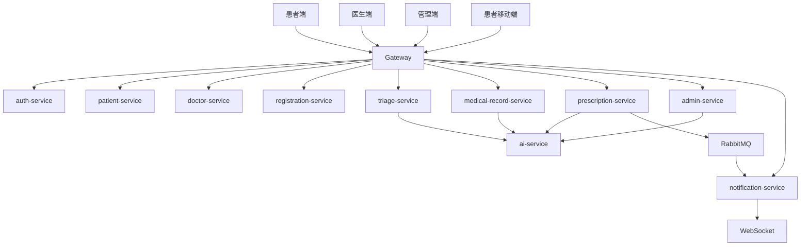

# 系统架构设计文档

## 1. 总体架构

系统采用前后端分离和 Spring Cloud 微服务架构。前端三端统一访问 Gateway，Gateway 根据路由转发到各业务服务。业务服务按领域拆分，使用 KingbaseES/PostgreSQL 兼容数据库持久化数据，使用 RabbitMQ 和 WebSocket 完成异步通知。



## 2. 架构原则

- Gateway 是前端唯一 API 入口。
- 领域服务拥有自己的业务边界和数据边界。
- 服务间通过 OpenFeign 或内部接口调用。
- 核心数据以 KingbaseES 为事实库。
- AI 能力收敛在 `ai-service`，当前 Provider 为 Mock。
- 风险通知采用 RabbitMQ 异步事件和 WebSocket 推送。

## 3. 分层结构

```text
表现层：患者端、医生端、管理端、患者移动端
网关层：gateway-service
业务层：auth/patient/doctor/registration/triage/medical-record/prescription/admin
AI 层：ai-service
通知层：RabbitMQ、notification-service、WebSocket
数据层：KingbaseES/PostgreSQL 兼容数据库
部署层：Docker Compose、Nginx、Nacos
```

## 4. 安全架构

- 登录成功后由 `auth-service` 签发 JWT。
- `gateway-service` 校验 Token 并透传用户上下文。
- 业务服务根据角色和数据归属二次校验。
- 管理端接口要求 ADMIN 角色。
- 患者只能访问自己的挂号、病历和处方。
- 医生只能处理自己的接诊数据。

## 5. 可扩展点

- 新增真实模型 Provider 替换 Mock Provider。
- 扩展更多轻症知识库和药品规则。
- 将单库兼容部署演进为多 schema 或多实例部署。
- 增加审计日志、限流、熔断和监控面板。

