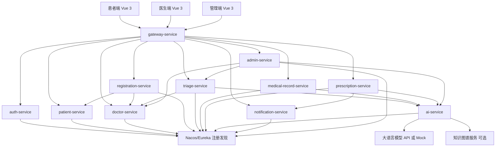
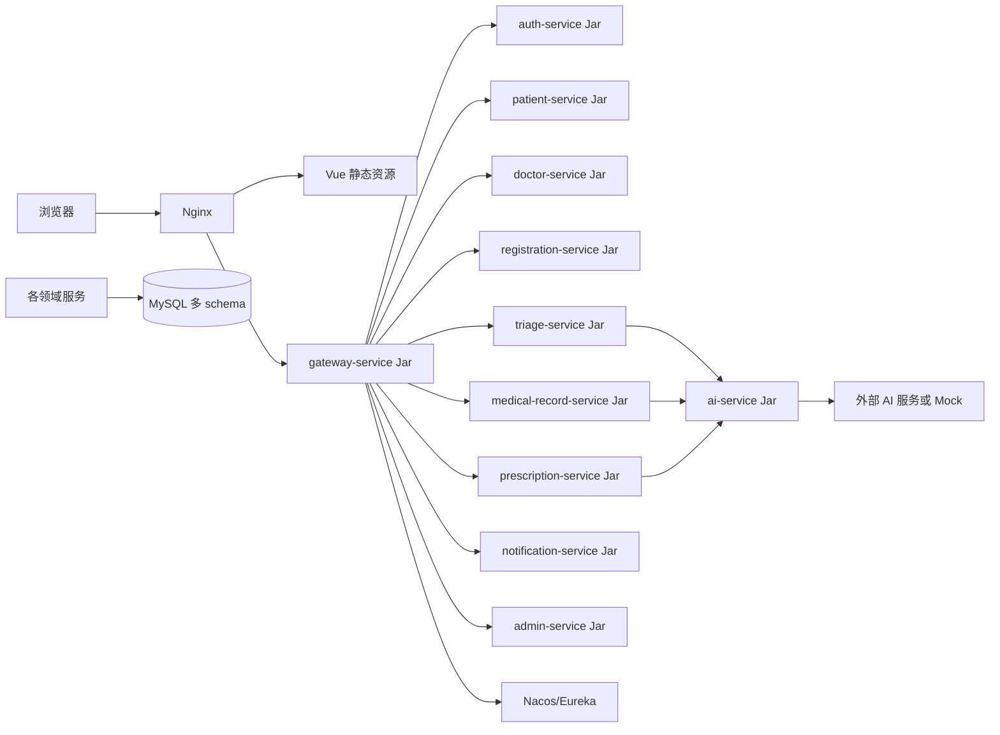
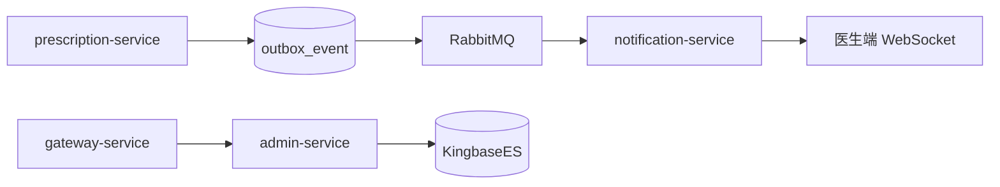

# 系统架构设计文档

## 1. 整体架构图

系统从项目初始化起采用纯微服务架构。前端只访问 `gateway-service`，所有业务能力由独立领域服务承担，跨服务数据访问通过 OpenFeign 和注册发现完成。



## 2. 模块之间的关系

| 模块 | 依赖模块 | 说明 |
|---|---|---|
| 网关服务 | 注册中心、认证服务 | 统一入口、路由、跨域、限流、Token 前置解析 |
| 认证服务 | 患者、医生、管理员账号 | 登录后生成 JWT 和角色信息 |
| 患者服务 | 认证服务 | 维护患者个人信息 |
| 医生服务 | 科室、排班 | 医生归属于科室，维护号源 |
| 挂号服务 | 患者服务、医生服务、分诊服务 | 创建患者与医生之间的预约关系 |
| 智能分诊服务 | 患者服务、医生服务、AI 服务 | 根据主诉推荐科室和医生，保存分诊记录 |
| 病历服务 | 挂号服务、患者服务、医生服务、AI 服务 | 生成和保存结构化病历 |
| 处方服务 | 病历服务、患者服务、AI 服务、通知服务 | 开方、AI 审核并触发高风险通知 |
| 通知服务 | 处方服务、认证服务 | 维护 WebSocket 连接和通知历史 |
| AI 服务 | 外部大模型、知识图谱 | Prompt 渲染、模型调用、结构化输出校验 |
| 管理服务 | 医生服务、分诊服务、AI 服务、各业务归属服务 | 管理端聚合入口，后台维护请求转发到对应服务，并编排 AI 排班和 AI 分诊台 |

## 3. 数据流转流程

1. 前端页面提交请求。
2. Axios 自动携带 JWT。
3. `gateway-service` 完成路由、跨域、限流和 Token 前置解析。
4. 目标业务服务的 Controller 校验请求参数。
5. 业务服务通过 OpenFeign 调用其他服务获取必要数据。
6. 如涉及 AI，由 `triage-service`、`medical-record-service` 或 `prescription-service` 调用 `ai-service`。
7. 各服务只持久化自己负责的数据。
8. 业务服务返回统一响应，网关透传给前端。
9. 前端更新页面状态。

## 4. 服务调用流程

### 4.1 智能分诊调用链

```text
gateway-service
  -> triage-service /api/triage/consult
    -> ai-service /internal/ai/triage
      -> AI HTTP API / Mock AI
    -> doctor-service 查询推荐医生
    -> triage-service 保存分诊记录
  -> 返回推荐结果
```

### 4.2 病历生成调用链

```text
gateway-service
  -> medical-record-service /api/medical-record/generate
    -> registration-service 校验挂号关系
    -> ai-service /internal/ai/medical-record/generate
      -> LLM API 生成结构化病历
  -> 返回草稿病历
```

保存时：

```text
gateway-service
  -> medical-record-service /api/medical-record/save
    -> registration-service 校验挂号关系
    -> medical-record-service 保存病历
```

### 4.3 处方审核调用链

```text
gateway-service
  -> prescription-service /api/prescription/check
    -> patient-service 获取患者基础信息
    -> ai-service /internal/ai/prescription/check
      -> AI API / 知识图谱服务
    -> prescription-service 保存审核记录
    -> notification-service 推送高风险告警
  -> 返回审核结果
```

### 4.4 管理端 AI 排班调用链

```text
gateway-service
  -> admin-service /api/admin/schedule/generate
    -> doctor-service 查询科室、医生和现有排班
    -> ai-service /internal/ai/schedule/generate
    -> admin-service 返回排班建议
  -> admin-service /api/admin/schedule/publish
    -> doctor-service /internal/doctors/schedules/publish
    -> doctor-service 保存排班和号源
```

### 4.5 管理端 AI 分诊台调用链

```text
gateway-service
  -> admin-service /api/admin/triage-desk/list
    -> triage-service 查询分诊记录
    -> doctor-service 补充科室和医生信息
  -> admin-service /api/admin/triage-desk/assign
    -> triage-service 更新人工改派结果
    -> registration-service 后续按改派结果挂号
```

## 5. 部署结构说明



部署时各领域服务独立进程运行、独立注册、独立日志和健康检查；MySQL 可共用实例，但必须按服务划分 schema，禁止跨 schema 直接查询。

## 6. 推荐端口

| 服务 | 本地端口 |
|---|---|
| Vue 开发服务 | `5173` |
| gateway-service | `8080` |
| auth-service | `8101` |
| patient-service | `8102` |
| doctor-service | `8103` |
| registration-service | `8104` |
| triage-service | `8105` |
| medical-record-service | `8106` |
| prescription-service | `8107` |
| ai-service | `8108` |
| notification-service | `8109` |
| admin-service | `8110` |
| Nacos 或 Eureka | `8848` 或 `8761` |
| MySQL | `3306` |
| Knife4j 聚合入口 | `http://localhost:8080/doc.html` |

## RabbitMQ / KingbaseES 搜索架构补充



`notification-service` 消费处方风险事件后入库并推送 WebSocket。知识库、药品、Prompt 模板搜索由 `admin-service` 直接查询 KingbaseES。
