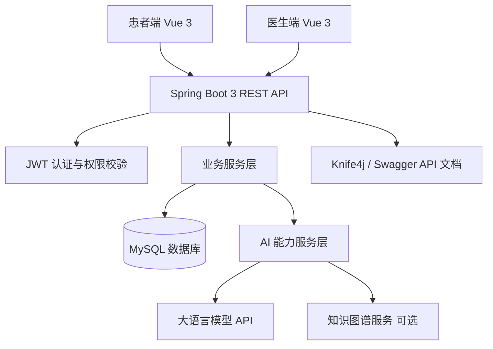
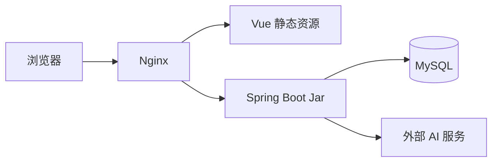

# 系统架构设计文档

## 1. 整体架构图



## 2. 模块之间的关系

| 模块 | 依赖模块 | 说明 |
|---|---|---|
| 认证模块 | 患者、医生 | 登录后生成 JWT 和角色信息 |
| 患者模块 | 认证模块 | 维护患者个人信息 |
| 医生模块 | 科室模块 | 医生归属于科室 |
| 挂号模块 | 患者、医生、科室、分诊记录 | 创建患者与医生之间的预约关系 |
| 智能分诊模块 | 患者、医生、AI 服务 | 根据主诉推荐科室和医生 |
| 病历模块 | 患者、医生、挂号、AI 服务 | 生成和保存结构化病历 |
| 处方模块 | 患者、医生、病历、AI 服务 | 开方并进行 AI 审核 |

## 3. 数据流转流程

1. 前端页面提交请求。
2. Axios 自动携带 JWT。
3. 后端网关层或拦截器完成身份识别。
4. Controller 校验请求参数。
5. Service 执行业务逻辑。
6. 如涉及 AI，调用 AI Service。
7. Repository 持久化业务数据和 AI 记录。
8. 后端返回统一响应。
9. 前端更新页面状态。

## 4. 服务调用流程

### 4.1 智能分诊调用链

```text
TriageController
  -> TriageService
    -> AITriageService
      -> AI HTTP API / Mock AI
    -> DoctorService 查询推荐医生
    -> TriageRecordRepository 保存分诊记录
  -> 返回推荐结果
```

### 4.2 病历生成调用链

```text
MedicalRecordController
  -> MedicalRecordService
    -> AIMedicalRecordService
      -> LLM API 生成结构化病历
  -> 返回草稿病历
```

保存时：

```text
MedicalRecordController
  -> MedicalRecordService
    -> RegistrationRepository 校验挂号关系
    -> MedicalRecordRepository 保存病历
```

### 4.3 处方审核调用链

```text
PrescriptionController
  -> PrescriptionService
    -> AIPrescriptionCheckService
      -> AI API / 知识图谱服务
    -> PrescriptionCheckRecordRepository 保存审核记录
  -> 返回审核结果
```

## 5. 部署结构说明



## 6. 推荐端口

| 服务 | 本地端口 |
|---|---|
| Vue 开发服务 | `5173` |
| Spring Boot | `8080` |
| MySQL | `3306` |
| Knife4j | `http://localhost:8080/doc.html` |

