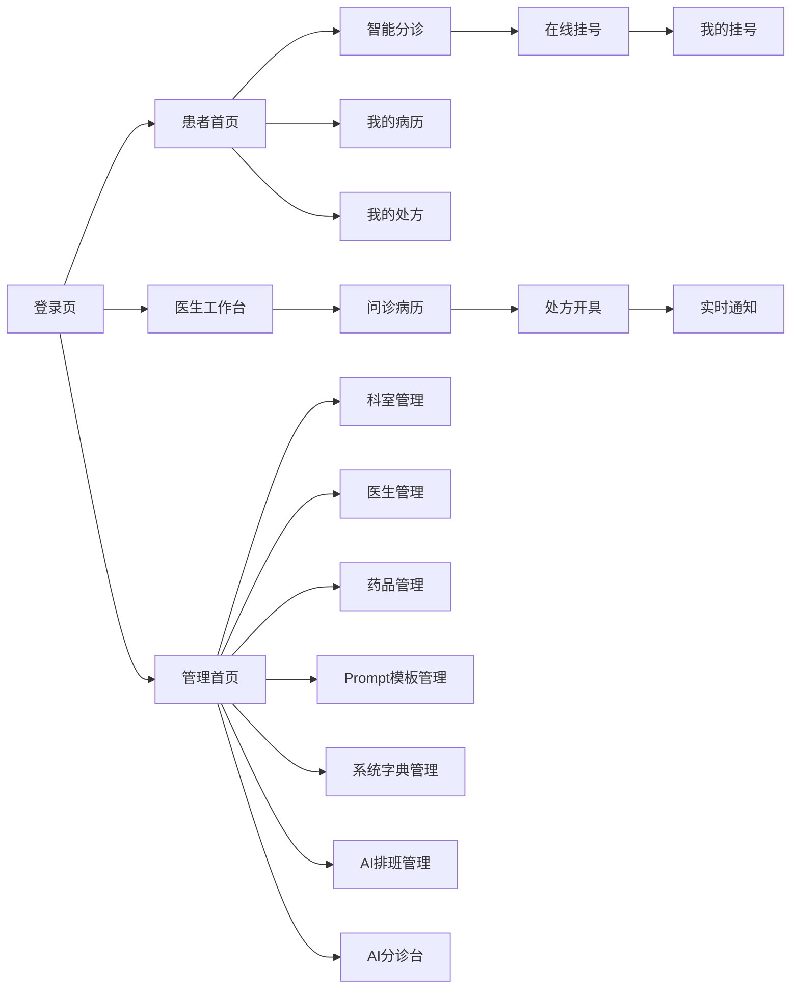

# 页面与交互文档

## 1. 页面列表

| 页面 | 路由建议 | 用户 | 功能 |
|---|---|---|---|
| 登录页 | `/login` | 患者/医生 | 登录系统 |
| 注册页 | `/register` | 患者 | 患者注册 |
| 患者首页 | `/patient/home` | 患者 | 展示快捷入口 |
| 智能分诊页 | `/patient/triage` | 患者 | 输入症状并查看 AI 推荐 |
| 在线挂号页 | `/patient/registration` | 患者 | 选择医生和时间段挂号 |
| 我的挂号页 | `/patient/registrations` | 患者 | 查看和取消挂号 |
| 我的病历页 | `/patient/records` | 患者 | 查看电子病历 |
| 我的处方页 | `/patient/prescriptions` | 患者 | 查看处方和审核结果 |
| 医生工作台 | `/doctor/workbench` | 医生 | 查看待诊患者 |
| 问诊病历页 | `/doctor/record/:registrationId` | 医生 | 生成和保存病历 |
| 处方开具页 | `/doctor/prescription/:patientId` | 医生 | 开方和 AI 审核 |
| 医生通知中心 | `/doctor/notifications` | 医生 | 查看 WebSocket 高风险用药告警 |
| 管理首页 | `/admin/home` | 管理员 | 基础数据和系统配置入口 |
| 科室管理 | `/admin/departments` | 管理员 | 科室增删改查、启停 |
| 医生管理 | `/admin/doctors` | 管理员 | 医生账号、科室、职称、擅长方向维护 |
| 药品管理 | `/admin/drugs` | 管理员 | 药品基础信息和规则维护 |
| Prompt 模板管理 | `/admin/prompts` | 管理员 | AI Prompt 模板维护 |
| 系统字典管理 | `/admin/dicts` | 管理员 | 字典类型、编码、名称、状态维护 |
| AI 排班管理 | `/admin/schedules` | 管理员 | 生成排班建议、人工确认、发布号源 |
| AI 分诊台 | `/admin/triage-desk` | 管理员 | 查看分诊记录、人工改派、关闭处理 |

## 2. 页面跳转关系

## 3. 表单字段

| 页面 | 字段 |
|---|---|
| 登录页 | 手机号、密码、角色 |
| 注册页 | 姓名、手机号、密码、确认密码、性别、年龄、过敏史、既往史 |
| 智能分诊页 | 主诉文本 |
| 在线挂号页 | 科室、医生、时间段 |
| 问诊病历页 | 医患对话、主诉、现病史、既往史、体格检查、诊断、治疗建议 |
| 处方开具页 | 药品名称、剂量、频次、用法 |
| 科室管理页 | 科室名称、科室描述、启停状态 |
| 医生管理页 | 姓名、手机号、登录密码、所属科室、职称、擅长方向、启停状态 |
| 药品管理页 | 药品名称、规格、禁忌说明、相互作用说明、启停状态 |
| Prompt 模板页 | 任务类型、科室编码、模板名称、模板内容、输出 Schema、版本、启停状态 |
| 系统字典页 | 字典类型、字典编码、显示名称、排序、启停状态 |
| AI 排班管理页 | 科室、日期范围、医生列表、班次、号源容量、AI 建议、发布状态 |
| AI 分诊台页 | 主诉、推荐科室、推荐医生、推荐理由、处理状态、改派科室、改派医生、处理备注 |

## 4. 按钮行为

| 按钮 | 行为 |
|---|---|
| 登录 | 校验表单，调用登录接口，保存 Token，跳转角色首页 |
| 注册 | 校验表单，调用注册接口，成功后跳转登录 |
| 智能分诊 | 调用 AI 分诊接口，展示推荐结果 |
| 去挂号 | 带入医生信息跳转在线挂号页 |
| 提交挂号 | 调用创建挂号接口，成功后跳转我的挂号 |
| 取消挂号 | 二次确认后调用取消接口 |
| AI 生成病历 | 调用病历生成接口，结果回填表单 |
| AI 流式生成病历 | 调用流式生成接口，逐字展示生成内容并回填表单 |
| 保存病历 | 校验必填字段，调用保存接口 |
| 添加药品 | 新增一行处方明细 |
| 删除药品 | 删除当前药品明细 |
| AI 辅助审核 | 调用处方审核接口，展示风险提示 |
| 保存处方 | 校验药品明细，保存处方和审核结果 |
| 查看告警 | 打开通知中心或处方详情，查看高风险用药告警 |
| AI 生成排班 | 调用排班生成接口，展示 AI 建议排班和号源 |
| 确认发布排班 | 管理员检查或调整 AI 建议后，发布正式排班和号源 |
| 分诊台改派 | 管理员选择新的科室或医生，提交人工改派结果 |
| 关闭分诊记录 | 管理员确认无需继续处理后关闭该分诊台记录 |

## 5. 异常提示

| 场景 | 提示 |
|---|---|
| 登录失败 | 账号或密码错误 |
| Token 过期 | 登录已过期，请重新登录 |
| 主诉为空 | 请填写症状描述 |
| AI 分诊失败 | AI 服务暂不可用，可手动选择科室挂号 |
| 挂号时间不可用 | 当前时间段不可预约，请重新选择 |
| 保存病历失败 | 病历保存失败，请稍后重试 |
| AI 处方审核失败 | AI 审核暂不可用，请医生人工确认 |
| WebSocket 断开 | 实时通知连接已断开，系统正在重连 |
| 流式生成中断 | AI 生成中断，可重试或继续手动填写 |
| AI 排班失败 | AI 排班暂不可用，可手动维护排班 |
| 排班发布冲突 | 当前医生或号源时间段已存在，请调整后重试 |
| 分诊台改派失败 | 改派失败，请检查医生状态或稍后重试 |
| 无权限 | 当前账号无权访问该页面 |

## 6. 空状态说明

| 页面 | 空状态 |
|---|---|
| 医生列表 | 暂无可预约医生 |
| AI 推荐结果 | 暂无推荐结果，请输入症状后分诊 |
| 我的挂号 | 暂无挂号记录 |
| 医生工作台 | 当前暂无待诊患者 |
| 我的病历 | 暂无病历记录 |
| 我的处方 | 暂无处方记录 |
| 医生通知中心 | 暂无实时告警 |
| AI 排班管理 | 暂无排班建议，请选择科室和日期后生成 |
| AI 分诊台 | 暂无待处理分诊记录 |

## 7. 必做任务交互要求

| 必做任务 | 页面表现 |
|---|---|
| WebSocket 实时通知 | 医生端登录后建立连接，高风险处方审核触发即时弹窗或通知抽屉 |
| AI 流式响应 | 病历生成时显示逐字输出区域，完成后自动回填结构化表单 |
| 前端状态机优化 | 分诊、挂号、病历、处方流程均有明确 loading、success、failed、retry 状态 |
| Prompt 工程 | 病历生成结果需要标记使用的模板类型，如通用模板、儿科模板、心内科模板 |
| 双端分离部署 | 页面资源路径和接口路径应适配 Nginx 反向代理 |
| 纯微服务架构 | 前端无感知，统一通过 `gateway-service` 的业务 API 调用 AI 能力 |
| 管理端必做入口 | 管理首页必须能进入基础数据维护、AI 排班管理和 AI 分诊台 |

## 8. 管理端交互闭环

| 场景 | 交互要求 |
|---|---|
| AI 排班生成 | 管理员先选择科室和日期范围，再选择医生和号源规则；生成过程中按钮禁用并展示 Loading |
| AI 排班确认 | AI 建议必须经过管理员人工确认才能发布，发布后患者端才可预约对应号源 |
| AI 分诊台查看 | 列表展示主诉、推荐科室、推荐医生、推荐理由、状态和创建时间 |
| AI 分诊台改派 | 管理员可以改派科室或医生，并填写处理备注；改派结果同步分诊记录 |
