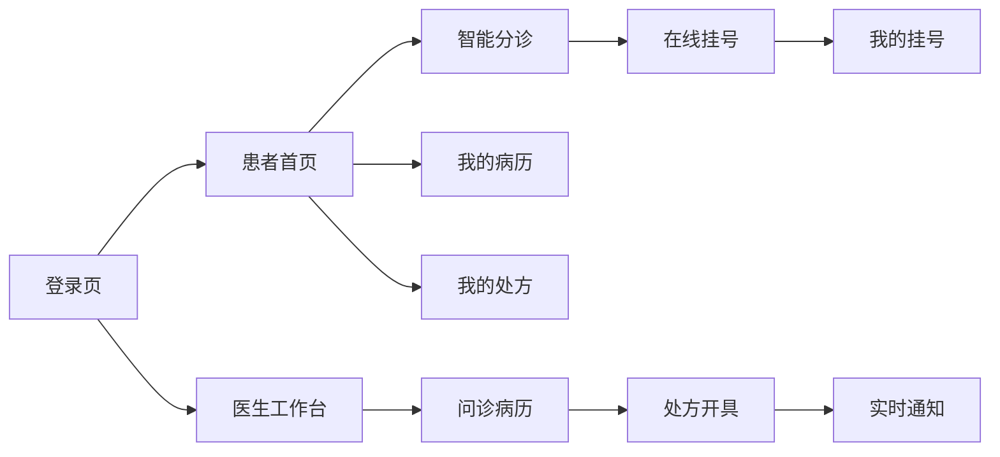

# 页面与交互文档

## 1. 页面列表

| 页面 | 路由建议 | 用户 | 功能 |
|---|---|---|---|
| 登录页 | `/login` | 患者/医生 | 登录系统 |
| 注册页 | `/register` | 患者 | 患者注册 |
| 患者首页 | `/patient/home` | 患者 | 展示快捷入口 |
| 智能分诊页 | `/patient/triage` | 患者 | 输入症状并查看 AI 推荐 |
| 在线挂号页 | `/patient/registration` | 患者 | 选择医生和时间段挂号 |
| 我的挂号页 | `/patient/registrations` | 患者 | 查看和取消挂号 |
| 我的病历页 | `/patient/records` | 患者 | 查看电子病历 |
| 我的处方页 | `/patient/prescriptions` | 患者 | 查看处方和审核结果 |
| 医生工作台 | `/doctor/workbench` | 医生 | 查看待诊患者 |
| 问诊病历页 | `/doctor/record/:registrationId` | 医生 | 生成和保存病历 |
| 处方开具页 | `/doctor/prescription/:patientId` | 医生 | 开方和 AI 审核 |
| 医生通知中心 | `/doctor/notifications` | 医生 | 查看 WebSocket 高风险用药告警 |

## 2. 页面跳转关系

## 3. 表单字段

| 页面 | 字段 |
|---|---|
| 登录页 | 手机号、密码、角色 |
| 注册页 | 姓名、手机号、密码、确认密码、性别、年龄、过敏史、既往史 |
| 智能分诊页 | 主诉文本 |
| 在线挂号页 | 科室、医生、时间段 |
| 问诊病历页 | 医患对话、主诉、现病史、既往史、体格检查、诊断、治疗建议 |
| 处方开具页 | 药品名称、剂量、频次、用法 |

## 4. 按钮行为

| 按钮 | 行为 |
|---|---|
| 登录 | 校验表单，调用登录接口，保存 Token，跳转角色首页 |
| 注册 | 校验表单，调用注册接口，成功后跳转登录 |
| 智能分诊 | 调用 AI 分诊接口，展示推荐结果 |
| 去挂号 | 带入医生信息跳转在线挂号页 |
| 提交挂号 | 调用创建挂号接口，成功后跳转我的挂号 |
| 取消挂号 | 二次确认后调用取消接口 |
| AI 生成病历 | 调用病历生成接口，结果回填表单 |
| AI 流式生成病历 | 调用流式生成接口，逐字展示生成内容并回填表单 |
| 保存病历 | 校验必填字段，调用保存接口 |
| 添加药品 | 新增一行处方明细 |
| 删除药品 | 删除当前药品明细 |
| AI 辅助审核 | 调用处方审核接口，展示风险提示 |
| 保存处方 | 校验药品明细，保存处方和审核结果 |
| 查看告警 | 打开通知中心或处方详情，查看高风险用药告警 |

## 5. 异常提示

| 场景 | 提示 |
|---|---|
| 登录失败 | 账号或密码错误 |
| Token 过期 | 登录已过期，请重新登录 |
| 主诉为空 | 请填写症状描述 |
| AI 分诊失败 | AI 服务暂不可用，可手动选择科室挂号 |
| 挂号时间不可用 | 当前时间段不可预约，请重新选择 |
| 保存病历失败 | 病历保存失败，请稍后重试 |
| AI 处方审核失败 | AI 审核暂不可用，请医生人工确认 |
| WebSocket 断开 | 实时通知连接已断开，系统正在重连 |
| 流式生成中断 | AI 生成中断，可重试或继续手动填写 |
| 无权限 | 当前账号无权访问该页面 |

## 6. 空状态说明

| 页面 | 空状态 |
|---|---|
| 医生列表 | 暂无可预约医生 |
| AI 推荐结果 | 暂无推荐结果，请输入症状后分诊 |
| 我的挂号 | 暂无挂号记录 |
| 医生工作台 | 当前暂无待诊患者 |
| 我的病历 | 暂无病历记录 |
| 我的处方 | 暂无处方记录 |
| 医生通知中心 | 暂无实时告警 |

## 7. 必做任务交互要求

| 必做任务 | 页面表现 |
|---|---|
| WebSocket 实时通知 | 医生端登录后建立连接，高风险处方审核触发即时弹窗或通知抽屉 |
| AI 流式响应 | 病历生成时显示逐字输出区域，完成后自动回填结构化表单 |
| 前端状态机优化 | 分诊、挂号、病历、处方流程均有明确 loading、success、failed、retry 状态 |
| Prompt 工程 | 病历生成结果需要标记使用的模板类型，如通用模板、儿科模板、心内科模板 |
| 双端分离部署 | 页面资源路径和接口路径应适配 Nginx 反向代理 |
| 微服务拆分 | 前端无感知，仍通过业务 API 调用 AI 能力 |
