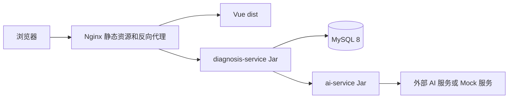

# 任务覆盖与必做任务方案

## 0. 口径说明

本文档结合 `东软智慧云脑诊疗平台实践任务描述(1).docx` 和用户补充图片要求整理。Word 文档中的项目初始化、传统业务、智能分诊、AI 处方审核、AI 病历生成、前后端联调、成果提交、答辩和非功能要求均作为基础必做内容；图片中的六项任务全部作为本项目必做升级项。

## 1. 原始任务覆盖矩阵

| 原始要求 | 文档覆盖 | 开发交付 | 优先级 |
|---|---|---|---|
| 项目概述、背景、目标用户 | `01-project-overview.md`、`02-requirements-analysis.md` | 项目说明、演示场景、用户角色 | P0 |
| 技术栈说明 | `04-technical-solution.md` | Spring Boot 3、Vue 3、TypeScript、MySQL、Knife4j、JWT | P0 |
| 学生参与说明 | `09-development-plan.md` | 后端、前端、AI 集成、联调任务拆分 | P0 |
| 项目初始化与环境搭建 | `04-technical-solution.md`、`09-development-plan.md`、`11-deployment-ops.md` | 前后端脚手架、统一响应、全局异常、CORS、Axios | P0 |
| 患者管理、医生管理、在线挂号 | `03-prd.md`、`06-database-design.md`、`07-api-design.md`、`08-ui-interaction.md` | 注册登录、医生列表、挂号创建、列表、取消 | P0 |
| 智能分诊 | `03-prd.md`、`05-system-architecture.md`、`07-api-design.md` | `/api/triage/consult`、分诊记录、推荐医生跳转挂号 | P0 |
| AI 处方辅助审核 | `03-prd.md`、`06-database-design.md`、`07-api-design.md` | `/api/prescription/check`、审核记录、风险等级展示 | P0 |
| AI 病历自动生成 | `03-prd.md`、`06-database-design.md`、`07-api-design.md` | `/api/medical-record/generate`、结构化病历回填和保存 | P0 |
| 前后端联调与综合演示 | `09-development-plan.md`、`10-test-plan.md` | 完整诊疗案例、Postman 记录、前端截图或录屏 | P0 |
| 成果要求、答辩要求 | `README.md`、`09-development-plan.md`、`10-test-plan.md` | 源码、数据库文档、PPT、演示视频、测试记录 | P0 |
| 非功能要求 | `02-requirements-analysis.md`、`10-test-plan.md`、`11-deployment-ops.md`、`12-risks.md` | 可运行、可演示、规范、友好、可扩展 | P0 |
| WebSocket 实时通知 | 本文档、`09-development-plan.md`、`10-test-plan.md` | 高风险处方实时告警 | P0 |
| AI 流式响应 | 本文档、`09-development-plan.md`、`10-test-plan.md` | 病历生成 SSE 或 WebSocket 流式输出 | P0 |
| 前端状态机优化 | 本文档、`09-development-plan.md`、`08-ui-interaction.md` | Pinia 模块化状态与流程状态枚举 | P0 |
| Prompt 工程优化 | 本文档、`09-development-plan.md`、`04-technical-solution.md` | 可配置 Prompt 模板、科室差异化模板 | P0 |
| 双端分离部署 | 本文档、`09-development-plan.md`、`11-deployment-ops.md` | Nginx 静态资源、Spring Boot Jar、环境变量 | P0 |
| 微服务拆分 | 本文档、`09-development-plan.md`、`04-technical-solution.md`、`05-system-architecture.md` | 独立 AI 服务、Spring Cloud Feign 调用、服务边界说明 | P0 |

## 2. 六项必做任务

以下六项来自任务图片，全部作为必做交付项；若与其他文档存在冲突，以本节为准。

| 顺序 | 必做任务 | 优先级 | 必做原因 |
|---|---|---|---|
| 1 | WebSocket 实时通知 | P0 | AI 审核发现高风险用药时，医生端必须收到实时告警 |
| 2 | AI 流式响应 | P0 | 病历生成必须支持 SSE 或 WebSocket 流式输出，前端逐字展示 |
| 3 | 前端状态机优化 | P0 | 使用 Pinia 管理患者、医生、挂号、处方等状态 |
| 4 | Prompt 工程优化 | P0 | 后端 Service 设计可配置 Prompt 模板，按科室优化病历生成质量 |
| 5 | 双端分离部署 | P0 | 前端 Nginx 静态资源，后端独立 Jar 包 |
| 6 | 微服务拆分 | P0 | AI 能力层抽取为独立微服务，使用 Spring Cloud Feign 实现服务间调用 |

## 3. 必做一：WebSocket 实时通知

### 3.1 目标

当 AI 处方审核发现高风险用药时，后端主动通过 WebSocket 向医生端推送实时告警。

### 3.2 后端设计

推荐路径：

```text
/ws/notifications
```

消息结构：

```json
{
  "type": "PRESCRIPTION_HIGH_RISK",
  "doctorId": 1,
  "patientId": 1,
  "prescriptionId": 200,
  "riskLevel": "HIGH",
  "title": "高风险用药提醒",
  "content": "检测到潜在药物相互作用，请复核处方。",
  "createdAt": "2026-06-14 16:00:00"
}
```

### 3.3 验收标准

- 医生端无需刷新即可收到高风险提醒。
- 只有处方所属医生能收到对应提醒。
- WebSocket 断开后不影响处方保存主流程。
- 告警消息可在前端通知列表中保留。

## 4. 必做二：AI 流式响应

### 4.1 目标

病历生成接口支持 SSE 或 WebSocket 流式输出，前端逐字展示 AI 生成内容，提升用户体验。

### 4.2 接口设计

```http
GET /api/medical-record/generate/stream?registrationId=100
Authorization: Bearer <jwt-token>
Accept: text/event-stream
```

事件类型建议：

| event | data |
|---|---|
| `start` | 任务开始、taskId |
| `delta` | 本次新增文本片段 |
| `structured` | 已解析出的结构化字段 |
| `done` | 生成完成 |
| `error` | 生成失败原因 |

### 4.3 验收标准

- 生成过程中页面不白屏、不阻塞。
- 用户能看到持续输出的文本。
- 断流或超时时显示失败原因。
- 流式接口不影响原有非流式 `/api/medical-record/generate`。

## 5. 必做三：前端状态机优化

### 5.1 目标

将患者分诊挂号、医生问诊病历、处方审核三条复杂流程从零散页面状态升级为可追踪、可恢复的流程状态，减少重复请求、页面刷新丢失状态和按钮误操作。

### 5.2 设计方案

Pinia 建议拆分如下：

| Store | 职责 |
|---|---|
| `useAuthStore` | Token、角色、用户信息、登录状态 |
| `useTriageStore` | 主诉、分诊结果、推荐医生、分诊记录 ID |
| `useRegistrationStore` | 科室、医生、时间段、挂号记录 |
| `useConsultationStore` | 当前接诊患者、问诊文本、病历草稿、保存状态 |
| `usePrescriptionStore` | 药品明细、审核结果、风险等级、保存状态 |
| `useAiTaskStore` | AI 请求 loading、错误、重试次数、流式输出内容 |

核心流程状态建议使用枚举：

```ts
type TriageStage = 'IDLE' | 'INPUTTING' | 'AI_RUNNING' | 'RECOMMENDED' | 'REGISTERING' | 'DONE' | 'FAILED'
type RecordStage = 'IDLE' | 'DIALOGUE_READY' | 'GENERATING' | 'DRAFT_READY' | 'SAVING' | 'SAVED' | 'FAILED'
type PrescriptionStage = 'EDITING' | 'CHECKING' | 'CHECKED' | 'SAVING' | 'SAVED' | 'HIGH_RISK'
```

### 5.3 验收标准

- 刷新页面后，Token 和基础用户信息仍可恢复。
- AI 请求期间相关按钮禁用，避免重复提交。
- AI 失败后流程进入 `FAILED`，页面保留人工操作入口。
- 高风险处方进入 `HIGH_RISK` 状态，必须医生二次确认后才能保存。

## 6. 必做四：Prompt 工程优化

### 6.1 目标

将 Prompt 从硬编码字符串升级为可配置模板，支持按任务类型和科室差异化生成，提高病历生成、分诊推荐、处方审核结果的稳定性。

### 6.2 后端设计

新增 `PromptTemplateService`，按 `taskType + departmentCode` 获取模板。

建议任务类型：

| 类型 | 场景 |
|---|---|
| `TRIAGE` | 根据主诉推荐科室和医生 |
| `MEDICAL_RECORD` | 根据问诊对话生成结构化病历 |
| `PRESCRIPTION_CHECK` | 根据患者信息和药品列表生成风险提示 |

建议模板字段：

| 字段 | 说明 |
|---|---|
| `id` | 模板 ID |
| `task_type` | 任务类型 |
| `department_code` | 科室编码，通用模板可为空 |
| `template_content` | Prompt 模板内容 |
| `output_schema` | 期望 JSON 结构 |
| `enabled` | 是否启用 |
| `version` | 模板版本 |

### 6.3 Prompt 约束

- 明确 AI 只提供辅助建议，不能替代医生。
- 强制输出 JSON，字段缺失时后端返回降级结果。
- 病历生成必须包含主诉、现病史、既往史、体格检查、初步诊断、治疗意见。
- 处方审核必须输出风险等级、风险原因、相互作用、处理建议。

### 6.4 验收标准

- 至少支持通用模板和心内科模板。
- 后端可以在不修改业务代码的情况下切换模板。
- AI 输出非 JSON 时，后端能够记录失败并返回明确错误。
- 答辩时能够说明 Prompt 如何影响 AI 结果质量。

## 7. 必做五：双端分离部署

### 7.1 目标

将 Vue 前端和 Spring Boot 后端按生产方式分离部署，前端由 Nginx 托管，后端以 Jar 包运行。

### 7.2 部署结构



### 7.3 验收标准

- 前端执行 `npm run build` 后生成 `dist`。
- `diagnosis-service` 和 `ai-service` 分别执行 `mvn clean package` 后生成 Jar。
- Nginx 能访问前端页面并代理 `/api`。
- 所有敏感配置通过环境变量注入，不写死在代码里。
- 可演示完整诊疗流程。

## 8. 必做六：AI 微服务拆分

### 8.1 目标

将 AI 能力层从主业务后端中拆出，形成独立 `ai-service`。主业务服务 `diagnosis-service` 使用 Spring Cloud Feign 调用 AI 服务，前端不直接访问 `ai-service`。

### 8.2 服务边界

| 服务 | 职责 |
|---|---|
| `diagnosis-service` | 用户、医生、挂号、病历、处方、权限、数据库主业务 |
| `ai-service` | 分诊、病历生成、处方审核、Prompt 模板、AI Provider 适配 |

### 8.3 调用方式

主服务保留接口不变：

```text
前端 -> diagnosis-service -> ai-service -> LLM/KG
```

内部接口建议：

| 接口 | 说明 |
|---|---|
| `POST /internal/ai/triage` | 智能分诊 |
| `POST /internal/ai/medical-record/generate` | 病历生成 |
| `GET /internal/ai/medical-record/generate/stream` | 流式病历生成 |
| `POST /internal/ai/prescription/check` | 处方审核 |

### 8.4 验收标准

- 主业务服务不直接依赖具体 AI Provider。
- AI 服务失败时，主服务能返回降级响应。
- Spring Cloud Feign 调用配置超时、重试和错误解码。
- 两个服务可以分别启动、分别查看日志。

## 9. 必做任务交付清单

| 必做任务 | 后端交付 | 前端交付 | 文档交付 |
|---|---|---|---|
| 状态机优化 | 无强制后端改造 | Pinia 模块、状态枚举、按钮禁用和恢复逻辑 | 状态流转图 |
| Prompt 工程 | 模板表、模板服务、AI Service 接入 | 模板配置展示或模板管理页面 | Prompt 设计说明 |
| 流式响应 | SSE 接口、事件协议、超时处理 | EventSource 接入、逐字展示、错误处理 | 流式接口说明 |
| WebSocket 通知 | WebSocket 配置、通知服务、消息结构 | 医生端连接、通知展示、重连 | 通知链路说明 |
| 分离部署 | Jar 包、环境变量、Nginx 代理 | `dist` 构建产物 | 部署步骤和截图 |
| 微服务拆分 | `diagnosis-service`、`ai-service`、Spring Cloud Feign、降级策略 | 无强制改造 | 服务边界和调用链 |

## 10. 答辩讲解重点

1. 项目主线不是单点 AI 演示，而是诊前、诊中、诊后的业务闭环。
2. AI 能力统一封装在 `ai-service`，前端不直接调用大模型。
3. 病历和处方必须由医生确认后保存，体现人机协作和医疗责任边界。
4. 微服务拆分是基础架构要求：业务服务负责诊疗主流程和权限，AI 服务负责模型调用、Prompt 和降级。
5. 六项必做任务体现工程能力：WebSocket 支持实时告警，SSE/WebSocket 流式响应提升体验，Pinia 状态机保证复杂流程稳定，Prompt 保证 AI 输出质量，分离部署体现工程交付，微服务拆分体现架构演进。
6. AI 不可用时系统仍可完成手动挂号、手动病历、手动处方，保证核心业务可用。
