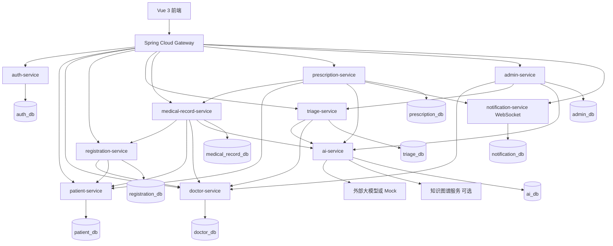

# 微服务架构说明

## 1. 架构定位

本项目采用 Spring Cloud 纯微服务架构，并以业务域服务作为唯一后端形态。前端只访问统一网关，网关根据路由转发到各业务服务；各服务独立负责自己的业务、数据、接口和故障边界。

基础目标：

- 使用 Spring Cloud Gateway 作为统一入口。
- 使用 Nacos 或 Eureka 完成服务注册发现。
- 使用 Nacos Config 或 Spring Cloud Config 管理服务配置。
- 使用 OpenFeign 完成服务间同步调用。
- 使用 Resilience4j 或 Sentinel 完成超时、熔断、限流和降级。
- 每个业务服务拥有独立数据库或独立 schema，禁止跨服务直接连表查询。
- AI、通知、认证都是独立领域服务，业务能力不集中堆叠在单个后端服务里。
- 管理端是第三个必做入口，`admin-service` 只负责聚合和编排，不直接跨库写其他服务业务数据。

## 2. 服务划分

```text
backend/
  gateway-service/               统一入口、路由、跨域、限流、鉴权前置
  auth-service/                  登录、JWT、角色、Token 刷新、账号基础信息
  patient-service/               患者资料、患者个人中心
  doctor-service/                医生、科室、排班、可预约时间段
  registration-service/          在线挂号、取消挂号、挂号记录
  triage-service/                分诊业务编排、分诊记录、推荐结果落库
  medical-record-service/        病历生成编排、病历保存、病历查询
  prescription-service/          处方开具、处方明细、处方审核记录
  ai-service/                    智能分诊、病历生成、处方审核、Prompt、模型适配
  notification-service/          WebSocket 连接、实时通知、通知历史
  admin-service/                 管理端聚合入口、系统配置、后台操作编排
  common-lib/                    Result、错误码、通用 DTO、工具类，不放业务逻辑
```

## 3. 服务职责边界

| 服务 | 核心职责 | 数据归属 |
|---|---|---|
| `gateway-service` | 统一入口、路由转发、CORS、基础限流、Token 解析前置 | 不落业务数据 |
| `auth-service` | 患者、医生、管理员登录，JWT 签发和校验，角色权限基础信息 | 账号、角色、登录审计 |
| `patient-service` | 患者注册资料、患者信息维护、患者查询 | 患者资料 |
| `doctor-service` | 医生、科室、排班、号源时间段 | 医生、科室、排班 |
| `registration-service` | 创建挂号、取消挂号、挂号列表、挂号状态流转 | 挂号记录 |
| `triage-service` | 接收主诉、调用 AI 分诊、匹配科室医生、保存分诊记录 | 分诊记录 |
| `medical-record-service` | 调用 AI 生成病历草稿、医生确认保存、病历列表详情 | 病历记录 |
| `prescription-service` | 开具处方、调用 AI 审核、保存处方和审核结果 | 处方、处方明细、审核记录 |
| `ai-service` | 模型 Provider 适配、Prompt 渲染、结构化输出校验、AI 降级 | AI 调用日志、Prompt 模板 |
| `notification-service` | WebSocket 通知、高风险用药告警、通知已读状态 | 通知消息 |
| `admin-service` | 管理端聚合入口、后台操作编排、系统配置维护、AI 排班编排、AI 分诊台编排 | 管理端配置数据；业务主数据仍归属各领域服务 |

## 4. 总体调用关系



## 5. 典型业务链路

### 5.1 智能分诊到挂号

```text
Vue 前端
  -> gateway-service
  -> triage-service /api/triage/consult
      -> ai-service /internal/ai/triage
      -> doctor-service 查询推荐科室和医生
      -> triage-service 保存分诊记录
  -> registration-service /api/registration/create
      -> doctor-service 校验医生和号源
      -> patient-service 校验患者
      -> registration-service 保存挂号记录
```

### 5.2 AI 病历生成和保存

```text
Vue 前端
  -> gateway-service
  -> medical-record-service /api/medical-record/generate
      -> registration-service 校验挂号和接诊关系
      -> ai-service /internal/ai/medical-record/generate
      -> 返回结构化病历草稿
  -> medical-record-service /api/medical-record/save
      -> 保存医生确认后的正式病历
```

### 5.3 处方审核和实时告警

```text
Vue 前端
  -> gateway-service
  -> prescription-service /api/prescription/check
      -> patient-service 获取患者基础信息
      -> ai-service /internal/ai/prescription/check
      -> prescription-service 保存审核记录
      -> notification-service 发送高风险 WebSocket 告警
  -> prescription-service /api/prescription/create
      -> 保存医生确认后的处方
```

### 5.4 管理端 AI 排班

```text
Vue 前端
  -> gateway-service
  -> admin-service /api/admin/schedule/generate
      -> doctor-service 查询科室、医生和现有排班
      -> ai-service /internal/ai/schedule/generate
      -> 返回 AI 排班建议
  -> admin-service /api/admin/schedule/publish
      -> doctor-service /internal/doctors/schedules/publish
      -> doctor-service 保存正式排班和号源
```

### 5.5 管理端 AI 分诊台

```text
Vue 前端
  -> gateway-service
  -> admin-service /api/admin/triage-desk/list
      -> triage-service /internal/triage-records
      -> doctor-service 补充科室和医生信息
  -> admin-service /api/admin/triage-desk/assign
      -> triage-service /internal/triage-records/{id}/assign
      -> triage-service 记录人工改派结果
```

## 6. 服务间通信原则

- 前端只访问 `gateway-service`，不直接访问任何业务微服务。
- 业务微服务之间通过 OpenFeign 调用，不直接访问对方数据库。
- 查询类调用可以同步 Feign；高风险通知、审计日志等非主链路动作优先异步事件。
- 每个 Feign Client 必须配置超时、重试上限、熔断和降级。
- AI 服务不可用时，分诊、病历、处方流程必须回退到人工操作模式。
- 服务间 DTO 不直接复用实体类，避免数据库模型泄露到服务契约。
- `admin-service` 只能通过内部接口编排 `doctor-service`、`triage-service` 和 `ai-service`，不得直接写入 `doctor_db`、`triage_db` 或 `ai_db`。

## 7. 数据边界

教学项目可以共用一个 MySQL 实例，但必须按服务划分独立数据库或 schema：

```text
auth_db
patient_db
doctor_db
registration_db
triage_db
medical_record_db
prescription_db
ai_db
notification_db
admin_db
```

要求：

- 禁止跨 schema 直接 join。
- 需要其他服务数据时，通过服务接口查询。
- 报表或演示聚合数据可以由网关后端聚合接口、专门查询接口或离线脚本生成。
- 每个服务只维护自己的迁移脚本和初始化数据。

## 8. 推荐端口

| 服务 | 端口 |
|---|---|
| `gateway-service` | `8080` |
| `auth-service` | `8101` |
| `patient-service` | `8102` |
| `doctor-service` | `8103` |
| `registration-service` | `8104` |
| `triage-service` | `8105` |
| `medical-record-service` | `8106` |
| `prescription-service` | `8107` |
| `ai-service` | `8108` |
| `notification-service` | `8109` |
| `admin-service` | `8110` |
| Nacos 或 Eureka | `8848` 或 `8761` |
| Vue 开发服务 | `5173` |
| MySQL | `3306` |

## 9. 项目结构建议

```text
smart_cloud_brain/
  README.md
  .gitignore
  .editorconfig
  docs/
  frontend/
    package.json
    pnpm-workspace.yaml
    tsconfig.base.json
    apps/
      patient-web/
      doctor-web/
      admin-web/
    packages/
      shared-api/
      shared-ui/
      shared-utils/
      shared-types/
  backend/
    pom.xml                         Maven 父工程
    common-lib/
    gateway-service/
    auth-service/
    patient-service/
    doctor-service/
    registration-service/
    triage-service/
    medical-record-service/
    prescription-service/
    ai-service/
    notification-service/
    admin-service/
  sql/
    auth_db.sql
    patient_db.sql
    doctor_db.sql
    registration_db.sql
    triage_db.sql
    medical_record_db.sql
    prescription_db.sql
    ai_db.sql
    notification_db.sql
    admin_db.sql
    demo_seed_data.sql
  deploy/
    nacos/
    mysql/
    nginx/
    env/
    docker-compose.yml
  scripts/
  postman/
```

## 10. 答辩表述

推荐表述：

> 本项目采用 Spring Cloud 纯微服务架构。系统以 Gateway 作为统一入口，按认证、患者、医生、挂号、分诊、病历、处方、AI、通知和管理等业务域划分服务。服务通过注册中心发现彼此，通过 OpenFeign 完成同步调用，通过熔断降级保证 AI 或下游服务异常时主流程可恢复。每个服务拥有独立数据边界，前端不直接调用业务服务或 AI 服务。

> 管理端是第三个必做入口。`admin-service` 负责管理端聚合和后台操作编排：AI 排班通过 `ai-service` 生成建议，并由 `doctor-service` 发布正式排班和号源；AI 分诊台通过 `triage-service` 查询和更新分诊记录。管理端不绕过服务边界直接跨库写业务数据。

答辩时保持以上纯微服务口径，围绕业务域服务、服务治理和独立数据边界展开说明。
