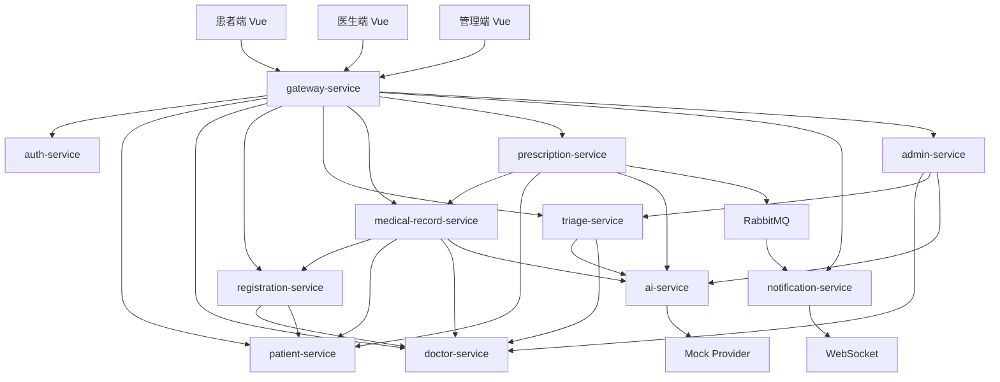

# 微服务架构说明

## 1. 架构定位

本项目采用 Gateway-first 的 Spring Cloud 微服务架构。前端三端只访问 `gateway-service`，网关完成鉴权、跨域和路由转发；业务能力由独立领域服务承担。

基础目标：

- 使用 Spring Cloud Gateway 作为统一入口。
- 使用 Nacos 完成服务注册发现。
- 使用 OpenFeign 完成服务间同步调用。
- 使用 RabbitMQ 承载异步事件。
- 使用 WebSocket 推送医生端实时通知。
- 每个服务拥有清晰数据边界，禁止跨服务直接连表。
- AI 能力收敛到 `ai-service`，当前 Provider 为 Mock。

## 2. 服务划分

| 服务 | 核心职责 | 数据归属 |
|---|---|---|
| `gateway-service` | 统一入口、JWT 校验、路由、CORS | 不落业务数据 |
| `auth-service` | 患者、医生、管理员登录 | 账号和认证信息 |
| `patient-service` | 患者资料和患者中心 | 患者资料 |
| `doctor-service` | 科室、医生、排班、号源 | 科室、医生、排班、号源 |
| `registration-service` | 创建挂号、取消挂号、挂号列表 | 挂号记录 |
| `triage-service` | 分诊编排、分诊记录、推荐结果 | 分诊记录 |
| `medical-record-service` | 病历生成编排、保存、查询 | 病历记录 |
| `prescription-service` | 处方开具、审核、Outbox 事件 | 处方和审核记录 |
| `ai-service` | AI Provider、Prompt、结构化结果 | AI 日志和 Prompt |
| `notification-service` | RabbitMQ 消费、WebSocket、通知历史 | 通知消息 |
| `admin-service` | 管理端聚合、基础数据、搜索 | 管理配置和聚合入口 |
| `common-lib` | 通用响应、安全上下文、事件常量 | 无业务数据 |
| `ai-api` | AI 服务间 DTO 契约 | 无业务数据 |

## 3. 总体调用关系



## 4. 典型业务链路

### 4.1 患者分诊到挂号

```text
患者端 -> gateway-service -> triage-service
triage-service -> ai-service -> Mock Provider
triage-service -> doctor-service 查询推荐科室和医生
triage-service 保存分诊记录
患者端 -> gateway-service -> registration-service
registration-service -> doctor-service 校验号源
registration-service -> patient-service 校验患者
registration-service 保存挂号并扣减号源
```

### 4.2 医生生成病历

```text
医生端 -> gateway-service -> medical-record-service
medical-record-service -> registration-service 校验挂号关系
medical-record-service -> ai-service 生成病历草稿
医生确认或修改后 -> medical-record-service 保存正式病历
```

### 4.3 处方审核与通知

```text
医生端 -> gateway-service -> prescription-service
prescription-service -> ai-service 执行处方审核
prescription-service 保存审核记录和处方
prescription-service 写 outbox_event
Outbox 发布器 -> RabbitMQ
notification-service 消费事件 -> notification_message
notification-service -> WebSocket 推送医生端
```

### 4.4 管理端 AI 排班

```text
管理端 -> gateway-service -> admin-service
admin-service -> doctor-service 查询医生和已有排班
admin-service -> ai-service 生成排班建议
管理员确认发布 -> admin-service -> doctor-service
doctor-service 保存正式排班和可预约号源
```

## 5. 数据边界

要求：

- 禁止跨服务直接 join。
- 需要其他服务数据时，通过服务接口查询。
- 管理端只能通过服务接口编排，不能绕过领域服务直接写业务主数据。
- `ai-service` 只保存 AI 相关日志和模板，不保存正式病历、处方、挂号。

## 6. 答辩表述

推荐表述：

> 系统采用 Spring Cloud 微服务架构，以 Gateway 为统一入口，按认证、患者、医生、挂号、分诊、病历、处方、AI、通知和管理划分服务。前端不直接调用业务服务或 AI 服务。KingbaseES 是唯一事实库，RabbitMQ 与 WebSocket 支撑处方风险通知。当前 AI 使用 Mock Provider，但请求链路和业务落库都是真实后端流程。

